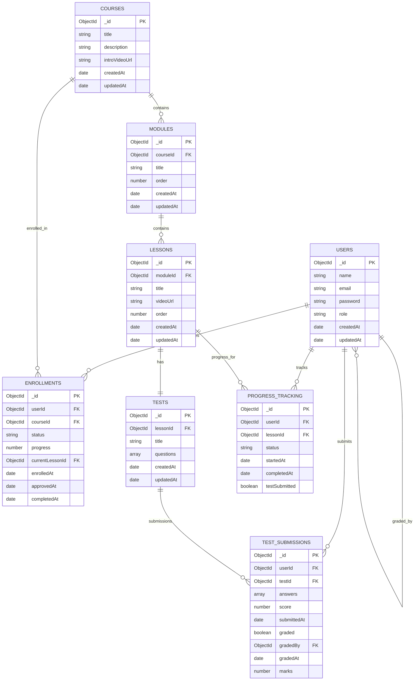

# Database Design

## Entity Relationship Diagram



## Collection Details

### Users Collection

**Schema Validation:**
```javascript
{
  $jsonSchema: {
    bsonType: "object",
    required: ["name", "email", "password", "role"],
    properties: {
      name: {
        bsonType: "string",
        description: "must be a string and is required"
      },
      email: {
        bsonType: "string",
        pattern: "^[a-zA-Z0-9._%+-]+@[a-zA-Z0-9.-]+\\.[a-zA-Z]{2,}$",
        description: "must be a valid email address and is required"
      },
      password: {
        bsonType: "string",
        minLength: 6,
        description: "must be a string with minimum 6 characters and is required"
      },
      role: {
        enum: ["student", "admin"],
        description: "can only be 'student' or 'admin' and is required"
      }
    }
  }
}
```

**Indexes:**
- `_id`: Primary key (automatically created)
- `email`: Unique index for fast lookups and ensuring uniqueness

### Courses Collection

**Schema Validation:**
```javascript
{
  $jsonSchema: {
    bsonType: "object",
    required: ["title", "description", "introVideoUrl"],
    properties: {
      title: {
        bsonType: "string",
        description: "must be a string and is required"
      },
      description: {
        bsonType: "string",
        description: "must be a string and is required"
      },
      introVideoUrl: {
        bsonType: "string",
        pattern: "^https?://",
        description: "must be a valid URL and is required"
      }
    }
  }
}
```

**Indexes:**
- `_id`: Primary key (automatically created)

### Modules Collection

**Schema Validation:**
```javascript
{
  $jsonSchema: {
    bsonType: "object",
    required: ["courseId", "title", "order"],
    properties: {
      courseId: {
        bsonType: "objectId",
        description: "must be an objectId and is required"
      },
      title: {
        bsonType: "string",
        description: "must be a string and is required"
      },
      order: {
        bsonType: "int",
        minimum: 0,
        description: "must be a non-negative integer and is required"
      }
    }
  }
}
```

**Indexes:**
- `_id`: Primary key (automatically created)
- `courseId`: Index for querying modules by course

### Lessons Collection

**Schema Validation:**
```javascript
{
  $jsonSchema: {
    bsonType: "object",
    required: ["moduleId", "title", "videoUrl", "order"],
    properties: {
      moduleId: {
        bsonType: "objectId",
        description: "must be an objectId and is required"
      },
      title: {
        bsonType: "string",
        description: "must be a string and is required"
      },
      videoUrl: {
        bsonType: "string",
        pattern: "^https?://",
        description: "must be a valid URL and is required"
      },
      order: {
        bsonType: "int",
        minimum: 0,
        description: "must be a non-negative integer and is required"
      }
    }
  }
}
```

**Indexes:**
- `_id`: Primary key (automatically created)
- `moduleId`: Index for querying lessons by module

### Enrollments Collection

**Schema Validation:**
```javascript
{
  $jsonSchema: {
    bsonType: "object",
    required: ["userId", "courseId", "status"],
    properties: {
      userId: {
        bsonType: "objectId",
        description: "must be an objectId and is required"
      },
      courseId: {
        bsonType: "objectId",
        description: "must be an objectId and is required"
      },
      status: {
        enum: ["pending", "approved", "rejected"],
        description: "must be 'pending', 'approved', or 'rejected' and is required"
      },
      progress: {
        bsonType: "int",
        minimum: 0,
        maximum: 100,
        description: "must be an integer between 0 and 100"
      },
      currentLessonId: {
        bsonType: "objectId",
        description: "must be an objectId"
      }
    }
  }
}
```

**Indexes:**
- `_id`: Primary key (automatically created)
- `userId`: Index for querying enrollments by user
- `courseId`: Index for querying enrollments by course
- `status`: Index for filtering by enrollment status

### Tests Collection

**Schema Validation:**
```javascript
{
  $jsonSchema: {
    bsonType: "object",
    required: ["lessonId", "title", "questions"],
    properties: {
      lessonId: {
        bsonType: "objectId",
        description: "must be an objectId and is required"
      },
      title: {
        bsonType: "string",
        description: "must be a string and is required"
      },
      questions: {
        bsonType: "array",
        minItems: 1,
        items: {
          bsonType: "object",
          required: ["questionText", "options", "correctAnswer"],
          properties: {
            questionText: {
              bsonType: "string",
              description: "must be a string and is required"
            },
            options: {
              bsonType: "array",
              minItems: 2,
              items: {
                bsonType: "string"
              },
              description: "must be an array of strings with at least 2 items and is required"
            },
            correctAnswer: {
              bsonType: "int",
              minimum: 0,
              description: "must be a non-negative integer representing the index of the correct option and is required"
            }
          }
        },
        description: "must be an array of question objects and is required"
      }
    }
  }
}
```

**Indexes:**
- `_id`: Primary key (automatically created)
- `lessonId`: Index for querying tests by lesson

### TestSubmissions Collection

**Schema Validation:**
```javascript
{
  $jsonSchema: {
    bsonType: "object",
    required: ["userId", "testId", "answers"],
    properties: {
      userId: {
        bsonType: "objectId",
        description: "must be an objectId and is required"
      },
      testId: {
        bsonType: "objectId",
        description: "must be an objectId and is required"
      },
      answers: {
        bsonType: "array",
        items: {
          bsonType: "object",
          required: ["questionIndex", "selectedOption"],
          properties: {
            questionIndex: {
              bsonType: "int",
              minimum: 0,
              description: "must be a non-negative integer and is required"
            },
            selectedOption: {
              bsonType: "int",
              minimum: 0,
              description: "must be a non-negative integer and is required"
            }
          }
        },
        description: "must be an array of answer objects and is required"
      },
      score: {
        bsonType: "int",
        minimum: 0,
        description: "must be a non-negative integer"
      },
      graded: {
        bsonType: "bool",
        description: "must be a boolean"
      },
      gradedBy: {
        bsonType: "objectId",
        description: "must be an objectId"
      },
      marks: {
        bsonType: "int",
        minimum: 0,
        description: "must be a non-negative integer"
      }
    }
  }
}
```

**Indexes:**
- `_id`: Primary key (automatically created)
- `userId`: Index for querying submissions by user
- `testId`: Index for querying submissions by test
- Composite index on `userId` and `testId` for efficient lookups

### ProgressTracking Collection

**Schema Validation:**
```javascript
{
  $jsonSchema: {
    bsonType: "object",
    required: ["userId", "lessonId", "status"],
    properties: {
      userId: {
        bsonType: "objectId",
        description: "must be an objectId and is required"
      },
      lessonId: {
        bsonType: "objectId",
        description: "must be an objectId and is required"
      },
      status: {
        enum: ["not_started", "in_progress", "completed"],
        description: "must be 'not_started', 'in_progress', or 'completed' and is required"
      },
      testSubmitted: {
        bsonType: "bool",
        description: "must be a boolean"
      }
    }
  }
}
```

**Indexes:**
- `_id`: Primary key (automatically created)
- `userId`: Index for querying progress by user
- `lessonId`: Index for querying progress by lesson
- Composite index on `userId` and `lessonId` for efficient lookups
- `status`: Index for filtering by progress status

## Relationships Explanation

1. **Users ↔ Enrollments**: One-to-many relationship. A user can have multiple enrollments.
2. **Courses ↔ Modules**: One-to-many relationship. A course can have multiple modules.
3. **Modules ↔ Lessons**: One-to-many relationship. A module can have multiple lessons.
4. **Lessons ↔ Tests**: One-to-one relationship. Each lesson can have one test.
5. **Users ↔ TestSubmissions**: One-to-many relationship. A user can submit multiple tests.
6. **Users ↔ ProgressTracking**: One-to-many relationship. A user can have progress records for multiple lessons.
7. **Courses ↔ Enrollments**: One-to-many relationship. A course can have multiple enrollments.
8. **Lessons ↔ ProgressTracking**: One-to-many relationship. A lesson can have progress records for multiple users.
9. **Tests ↔ TestSubmissions**: One-to-many relationship. A test can have multiple submissions.
10. **Users (admins) ↔ TestSubmissions**: One-to-many relationship. An admin can grade multiple test submissions.

## Sample Queries

### Get all modules and lessons for a course
```javascript
db.courses.aggregate([
  { $match: { _id: ObjectId("COURSE_ID") } },
  {
    $lookup: {
      from: "modules",
      localField: "_id",
      foreignField: "courseId",
      as: "modules"
    }
  },
  {
    $unwind: "$modules"
  },
  {
    $lookup: {
      from: "lessons",
      localField: "modules._id",
      foreignField: "moduleId",
      as: "modules.lessons"
    }
  },
  {
    $group: {
      _id: "$_id",
      title: { $first: "$title" },
      description: { $first: "$description" },
      introVideoUrl: { $first: "$introVideoUrl" },
      modules: { $push: "$modules" }
    }
  }
])
```

### Get student progress for a course
```javascript
db.enrollments.aggregate([
  { $match: { userId: ObjectId("USER_ID"), courseId: ObjectId("COURSE_ID") } },
  {
    $lookup: {
      from: "courses",
      localField: "courseId",
      foreignField: "_id",
      as: "course"
    }
  },
  {
    $unwind: "$course"
  },
  {
    $lookup: {
      from: "modules",
      localField: "course._id",
      foreignField: "courseId",
      as: "modules"
    }
  },
  {
    $unwind: "$modules"
  },
  {
    $lookup: {
      from: "lessons",
      localField: "modules._id",
      foreignField: "moduleId",
      as: "modules.lessons"
    }
  },
  {
    $unwind: "$modules.lessons"
  },
  {
    $lookup: {
      from: "progress_tracking",
      localField: "modules.lessons._id",
      foreignField: "lessonId",
      as: "modules.lessons.progress",
      pipeline: [
        { $match: { userId: ObjectId("USER_ID") } }
      ]
    }
  },
  {
    $group: {
      _id: {
        enrollmentId: "$_id",
        moduleId: "$modules._id"
      },
      enrollment: { $first: "$$ROOT" },
      lessons: { $push: "$modules.lessons" }
    }
  },
  {
    $group: {
      _id: "$_id.enrollmentId",
      enrollment: { $first: "$enrollment" },
      modules: {
        $push: {
          _id: "$_id.moduleId",
          lessons: "$lessons"
        }
      }
    }
  }
])
```

### Get test submissions for grading
```javascript
db.test_submissions.aggregate([
  { $match: { graded: false } },
  {
    $lookup: {
      from: "tests",
      localField: "testId",
      foreignField: "_id",
      as: "test"
    }
  },
  {
    $unwind: "$test"
  },
  {
    $lookup: {
      from: "users",
      localField: "userId",
      foreignField: "_id",
      as: "student"
    }
  },
  {
    $unwind: "$student"
  },
  {
    $project: {
      _id: 1,
      userId: 1,
      testId: 1,
      answers: 1,
      submittedAt: 1,
      "test.title": 1,
      "student.name": 1,
      "student.email": 1
    }
  }
])
```